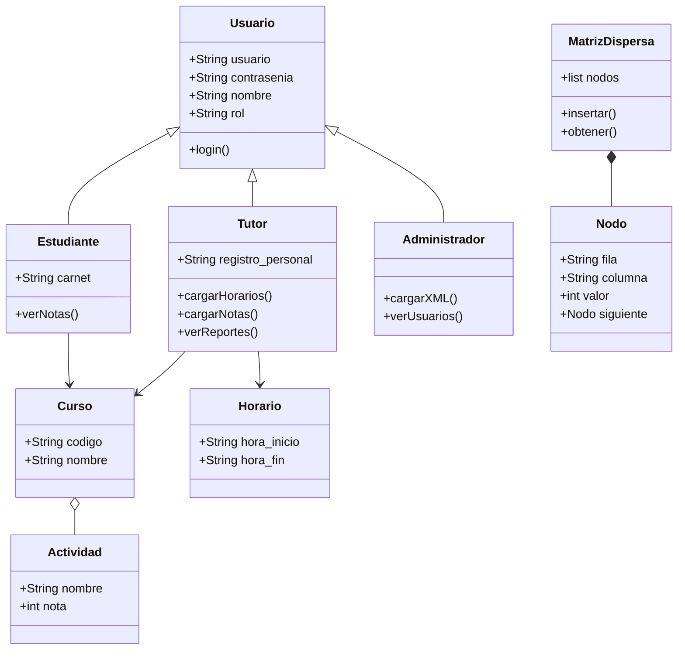

# 🎓 PPCYL2-AcadNet


> Plataforma web educativa que conecta estudiantes con tutores especializados dentro del entorno académico.

**Universidad Mariano Gálvez de Guatemala**  
**Curso:** Programación para la Ciencia y la Ingeniería II  
**Estudiante:** Luis Cuadra  
**Carnet:** 1113-25-24908

---

## 📋 Descripción

PPCYL2-AcadNet es una plataforma de apoyo académico que permite:
- Gestionar sesiones de tutoría
- Cargar y consultar notas académicas
- Generar reportes estadísticos con gráficas
- Administrar usuarios, cursos y horarios

---

## 🏗️ Arquitectura

El sistema usa arquitectura **cliente-servidor** con dos servicios:

| Servicio | Tecnología | Puerto |
|---|---|---|
| Frontend | Django | 8000 |
| Backend API | Flask | 5000 |

---

## 🚀 Cómo ejecutar el proyecto

### 1. Activar el entorno virtual
```bash
source venv/bin/activate
```

### 2. Backend (Flask)
```bash
cd backend
python app.py
```

### 3. Frontend (Django)
```bash
cd frontend
python manage.py runserver
```

### 4. Abrir en el navegador
http://127.0.0.1:8000

---

## 👥 Roles de usuario

| Rol | Funcionalidades |
|---|---|
| 👨‍💼 Administrador | Cargar XML, ver usuarios |
| 👨‍🏫 Tutor | Cargar horarios, cargar notas, ver reportes |
| 👨‍🎓 Estudiante | Ver sus notas por curso |

### Credenciales por defecto
- **Administrador:** `AdminPPCYL2` / `AdminPPCYL2771`

---

## 🔌 Endpoints de la API

| Endpoint | Método | Descripción |
|---|---|---|
| `/login` | POST | Iniciar sesión |
| `/cargar` | POST | Cargar XML de configuración |
| `/usuarios` | GET | Ver todos los usuarios |
| `/notas` | POST | Cargar notas |
| `/notas/<curso>/<carnet>` | GET | Consultar notas de un estudiante |
| `/horarios` | POST | Cargar horarios |
| `/reporte/promedio/<curso>` | GET | Reporte de promedios por actividad |

---

## 📁 Estructura del proyecto

    PPCYL2-AcadNet/
    ├── backend/
    │   ├── app.py          
    │   ├── matriz.py       
    │   └── *.xml           
    ├── frontend/
    │   ├── acadnet/        
    │   └── main/           
    │       ├── views.py    
    │       ├── urls.py     
    │       └── templates/  
    └── README.md
---

## 🧩 Conceptos implementados

- ✅ **API REST** con Flask y protocolo HTTP
- ✅ **Programación Orientada a Objetos** (Matriz Dispersa)
- ✅ **Expresiones Regulares** para extraer horarios
- ✅ **XML** como formato de entrada y salida
- ✅ **Gráficas** con ChartJS
- ✅ **Arquitectura cliente-servidor**

---

## 📄 Documentación

La documentación completa del proyecto se encuentra en la carpeta `/docs` del repositorio.

## 📊 Diagrama de Clases

